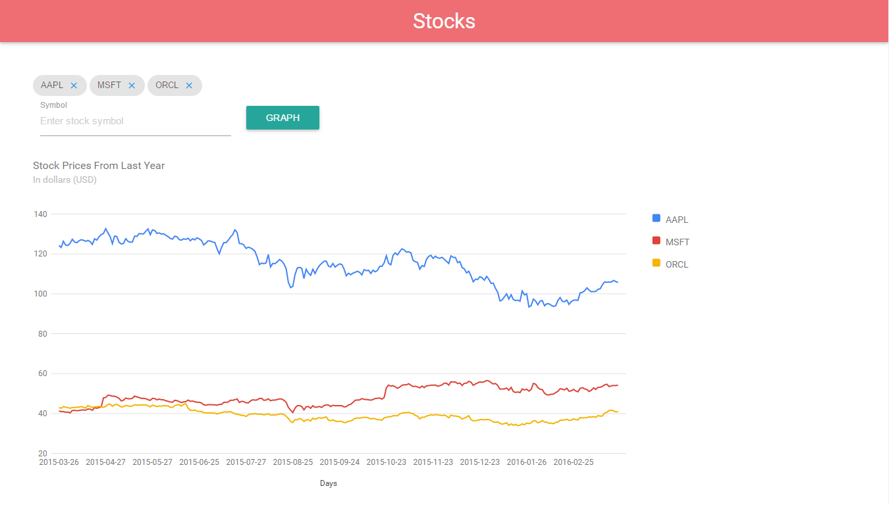

#Image Search Abstraction Layer

This is a solution for https://www.freecodecamp.com/challenges/chart-the-stock-market

User Story: I can view a graph displaying the recent trend lines for each added stock.

User Story: I can add new stocks by their symbol name.

User Story: I can remove stocks.

User Story: I can see changes in real-time when any other user adds or removes a stock. For this you will need to use Web Sockets.

##Screenshot

###Landing Page

##Technologies Used:
- Node.js
- Express
- Socket.io
- Async
